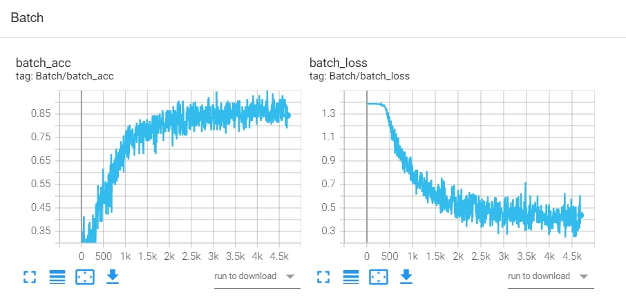
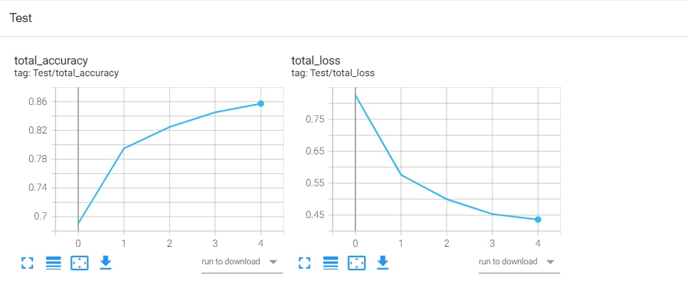
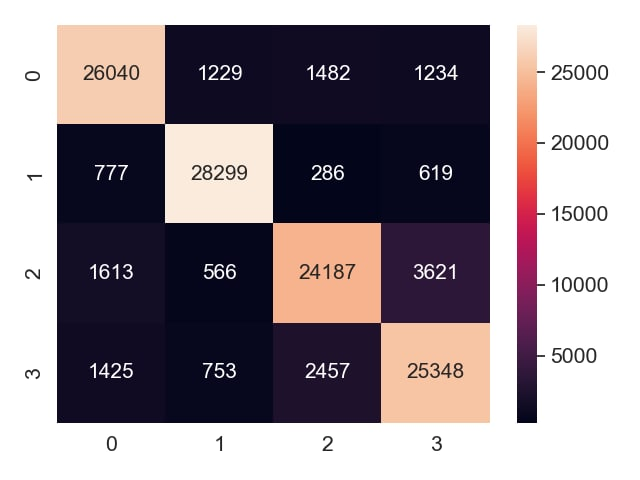
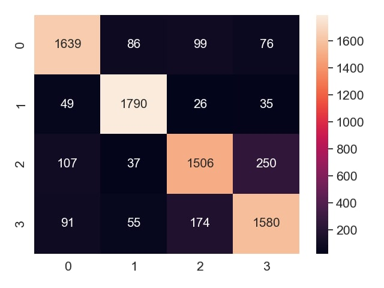
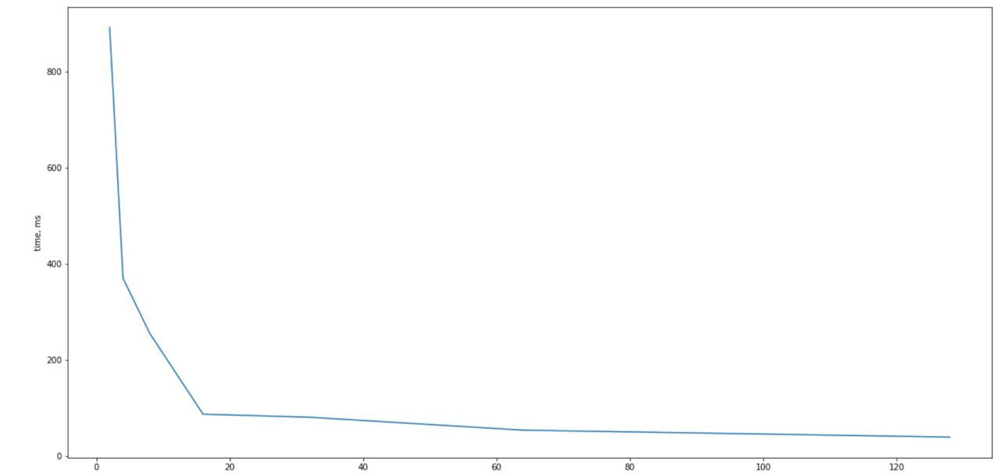

# fastText-PyTorch
Custom PyTorch implementation of fastText algorithm

## Result
- Model training on AG's corpus of news articles [link](http://groups.di.unipi.it/~gulli/AG_corpus_of_news_articles.html).

- Batch train loss / accuracy:

- Test loss / accuracy:

- Train confusion matrix:

- Test confusion matrix:

## Influence of batch size on training time in multiprocessing.

